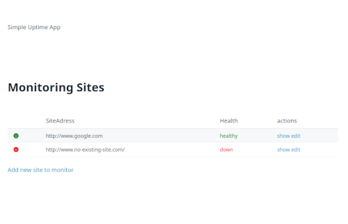
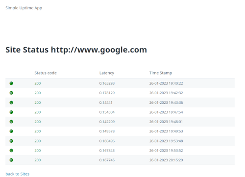

# Simple Site Status Monitoring

A minimalistic monitoring website to check if it's Healthy, build with Symfony

## Requirements
- Linux system
- PHP 8.1
- composer
- Mysql/Maria DB

## Getting Start
- Install dependencies : `composer install`
- Start Mysql DB service and set a symfony user with right privileges
- Set your local .env file to connect to the Mysql DB
- Execute migrations : `symfony console doctrine:migrations:migrate`
- Start the app : `symfony server:start` 
- Add a new site in <localApp>/sites
- Edit you CronJob : `crontab edit`
- Add this line : `*  *    * * *   <YourUser>    cd <YourProjectAppFolder>/site-uptime && symfony console app:status:add`
- you can check monitoring logs : `tail -f <YourProjectAppFolder>var/log/dev.log | grep app*`
